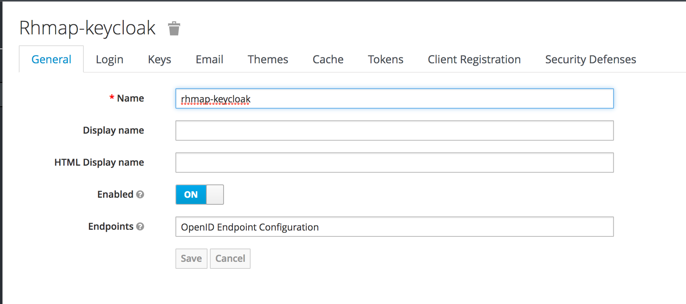
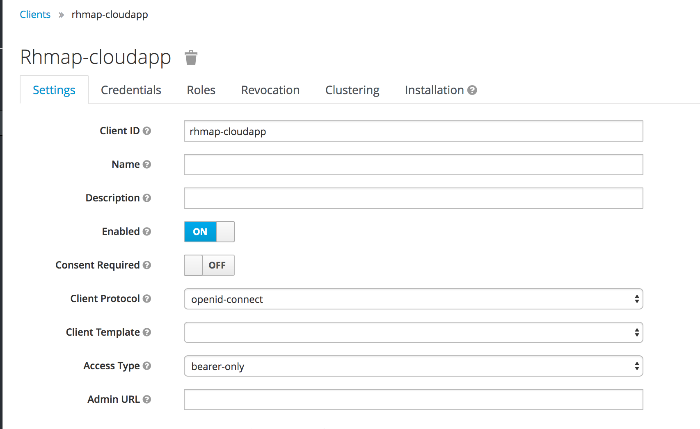
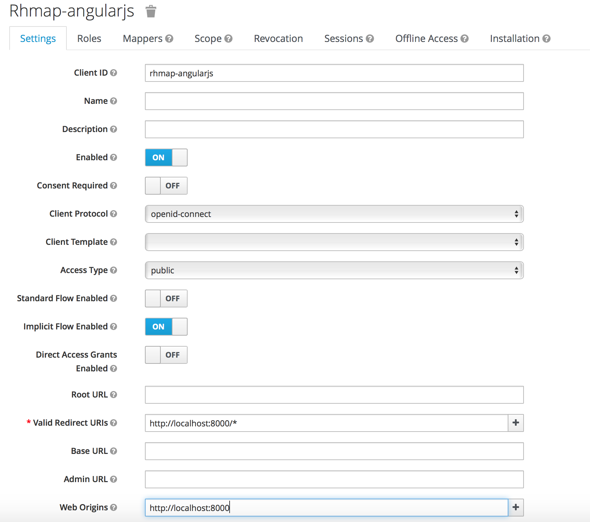
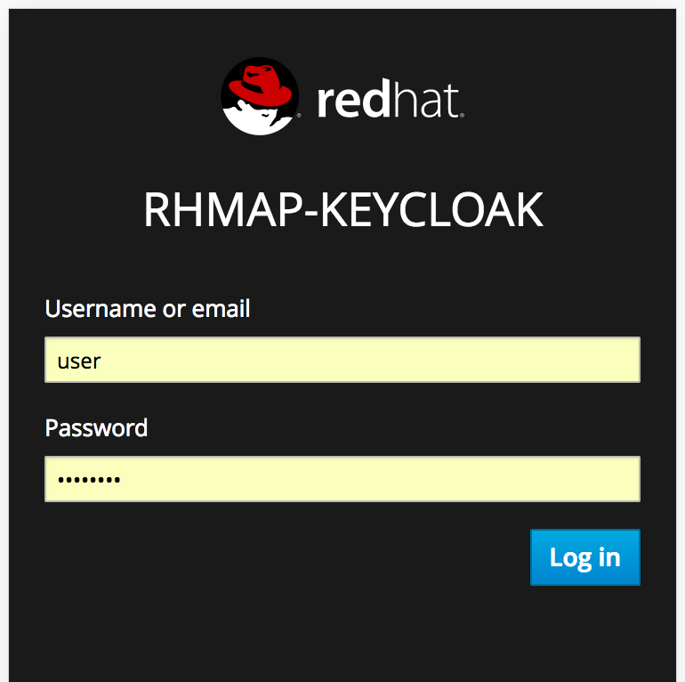
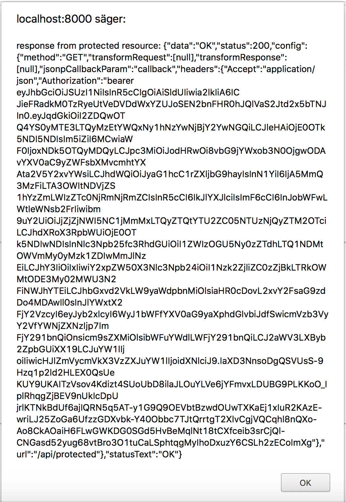

# rhmap-keycloak
This demo shows how to use RHSSO (Keycloak) for authenticating to an AngularJS app.
It also shows how to protect a CloudApp with RHSSO.

## Preparation
In order for the demo to work, the following steps need to be taken:
1. Install RHSSO 7.1.1 and create a realm
2. Create a RHSSO client for the CloudApp
3. Create a RHSSO client for the AngularJS application and create an application user
4. Download and install the Nodejs and Javascript Keycloak adapters

### Install RHSSO 7.1.1
```
1. Download and install RHSSO 7.1.1
(https://access.redhat.com/jbossnetwork/restricted/listSoftware.html?downloadType=distributions&product=core.service.rhsso) (https://keycloak.gitbooks.io/documentation/content/server_installation/topics/installation.html)
2. Login as admin to RHSSO (e.g. http://localhost:8080)
3. Create realm (e.g. rhmap-keycloak)
```



### Create a RHSSO client for the CloudApp
```
1. In the rhmap-keycloak realm, create a CloudApp client (e.g. rhmap-cloudapp)
2. In Settings, select `Access-Type: bearer-only`
3. Go to Installation
4. Select `Keycloak OIDC JSON` as Format
5. Download `keycloak.json` and store next to `application.js` (your CloudApp)
```



### Create a RHSSO client for the AngularJS application
```
1. In the rhmap-keycloak realm, create an AngularJS app client (e.g. rhmap-angular)
2. In Settings, select `Access-Type: public`
3. Go to Installation
4. Select `Keycloak OIDC JSON` as Format
5. Download `keycloak.json` and store in the app's public folder
6. In Settings, set up a valid redirect URI (e.g. https://localhost:8000/*)
7. In Settings, set up Web Origins (e.g. https://localhost:8000). This is necessary for CORS.
8. Go to the Users menu in RHSSO and add a user which will be used for logging in to the AngularJS app
```



### Download and install Keycloak adapters
```
1. Download and install Keycloak nodejs adapter 7.1.1 (https://access.redhat.com/jbossnetwork/restricted/listSoftware.html?downloadType=distributions&product=core.service.rhsso) or use `npm install keycloak-connect`
2. Download Keycloak Javascript adapter 7.1.1
3. Unzip and place under public/lib in your app directory
```

## Running the CloudApp
```
1. Install grunt `npm install grunt --save-dev`
2. Install grunt packages:
`npm install grunt-contrib-jshint --save-dev`
`npm install grunt-contrib-watch --save-dev`
`npm install grunt-env --save-dev`
`npm install grunt-nodemon --save-dev`
`npm install grunt-ng-constant --save-dev`
3. Run the CloudApp with `grunt` or `grunt serve:local`
```
This will start the CloudApp on `localhost:8000`. You can verify that it works by opening a browser and try to access `http://localhost:8000/api/ping`. You should see "pong" as a response.

The CloudApp also contains an API method that is protected by RHSSO:

```
app.get('/api/protected', keycloak.protect(), function (req, res) {
```

A simple test that RHSSO can be reached by the Keycloak Nodejs adapter is to open a browser and try to access `localhost:8000/api/protected`. You should see an Access Denied message.

Calling this method from the AngularJS app will require that an Access Token is passed in a header.

## Adding RHSSO to the AngularJS app
The AngularJS app can use RHSSO to authenticate the user before making REST calls to the
Cloud App. Note that the app needs to be bootstrapped manually in order to prevent
constant reloading due to the redirect sent back from RHSSO after authentication.

```
<script>
angular.element(document).ready(() => {
  window._keycloak = Keycloak();

  window._keycloak
    .init({
      onLoad: 'login-required'
    })
    .success(() => {
      angular.bootstrap(document, ['rhmap-keycloak']); // manually bootstrap Angular app
    });
});
</script>
```

The `_keycloak`variable can be accessed by other modules by injecting a service:

```
angular
    .module('auth', ['ui.router'])
    .service('authService', ['$window',
    function($window) {

    return $window._keycloak;
}]);
```

When calling a protected resource in the Cloud App, the Authorization header must be added:

When the CloudApp runs locally:
```
$http.get('/api/protected',
{headers:{'Accept': 'application/json', 'Authorization': 'bearer ' + authService.token}});
```

When the CloudApp runs on RHMAP, the $fh.cloud API is used. Note also the use of `defer`in order to return a promise to the controller in the same way as `$http` does.
```
$fh.cloud({
  "path": "/api/protected",
  "method": "GET",
  "contentType": "application/json",
  "headers": {"Authorization": 'bearer ' + authService.token},
  "timeout": 25000
}, function(res) {
  deferred.resolve(res);
}, function(msg,err) {
  deferred.reject({status: err.status, statusText: msg});
});
```

## Running the demo
Start the CloudApp locally with `grunt serve:local` or just `grunt`.
Open a browser at the location of your CloudApp, e.g. http://localhost:8000
If you haven't authenticated to RHSSO a login prompt served from RHSSO will be shown:



After logging in with the user you created in RHSSO you will be able to access the AngularJS App
The app will immediately try to access the protected CloudApp resource `/api/protected` using the Access Token provided by the Javascript Keycloak adapter. If everything works you should see an Alert box containing "Response from protected resource, data:"OK", status: 200 and the Access Token.



## Deploying to RHMAP
When deploying the demo on RHMAP it's necessary to also redeploy RHSSO on a routable server in order for the CloudApp to be able to validate the Access Token.

### Deploying a routable RHSSO instance
In order for the CloudApp running on RHMAP to be able to access RHSSO it needs to be deployed on a server with a routable IP address. Also since RHSSO is intended to be accessible on the 127.0.0.1 address only, it is recommended to install a reverse proxy on the same host to provide an external URI to RHSSO, for example HAProxy which is installed on RHEL with `yum install haproxy`.
HAProxy is then configured to forward requests to RHSSO as follows:

```
/etc/haproxy/haproxy.cfg:

frontend http_web *:80
  mode http
  default_backend rgw

backend rgw
  balance roundrobin
  mode http
  stats enable
  stats hide-version
  stats uri /stats
  stats realm Haproxy\ Statistics
  stats auth haproxy:redhat
  server  keycloak 127.0.0.1:8080 check
```

The global and default sections can be left with default settings.
For a full description on how to configure HAProxy refer to (https://access.redhat.com/documentation/en-US/Red_Hat_Enterprise_Linux/7/html/Load_Balancer_Administration/install_haproxy_example1.html).
You can access HAProxy statistics on the server (e.g. http://rhsso-host/stats) using haproxy/redhat as username/password. You should now be able to access RHSSO on http://rhsso-host:80 and log in to the Admin app.

To support running behind a reverse proxy, RHSSO must be configured to read the client's IP address from the X-Forwarded-For header. This is done by adding the attribute `proxy-address-forwarding="true"` to the standalone.xml configuration file.

```
<subsystem xmlns="urn:jboss:domain:undertow:3.1">
            <buffer-cache name="default"/>
            <server name="default-server">
                <http-listener name="default" socket-binding="http" redirect-socket="https" proxy-address-forwarding="true"/>
```

Also haproxy.cfg must contain `option forwardfor` in order to properly set the client's IP in the X-Forwarded-For header.

```
defaults

    option forwardfor       except 127.0.0.0/8
```

When RHSSO and HAProxy is up and running, the next step is to deploy the CloudApp on RHMAP.

### Deploying the CloudApp

To deploy the CloudApp on RHMAP do the following steps:
```
1. In App Studio go to Projects then choose Import.
2. Create New Project
3. Select Empty Project
4. Select App Type = Cloud App
5. Import from public git repo and use the link to this repo: https://github.com/torbjorndahlen/rhmap-keycloak.git
6. Go to the CloudApp's Editor menu and open the file `rhmap-keycloak/public/js/util/config.js`
7. Change the line `.constant('ENV', {name:'local',apiEndpoint:'http://localhost:8000'})` to `.constant('ENV', {name:'remote',apiEndpoint:''})` and save the file
8. Create a connection tag which requires a Client App. Simply go to Projects and create a Hello World App in the project.
9. Go to Connections and create a new Connection
10. Select Configure and copy everything in the JSON object into the file `fhconfig` which is located under `rhmap-keycloak/public`.
11. The `auth-server-url`in keycloak.json for both the CloudApp and the AngularJS app needs to be
changed to the server and port where HAProxy is running.
12. Deploy the Cloud App
13. Use the link to the Cloud App to access the mobile app
```

## Troubleshooting

### Chrome adding Authorization Basic header
Note that trying to login to RHSSO from Chrome (v.59.0.3071.115) causes an infinite loop when RHSSO is deployed on a routable server behind HAProxy. This is since Chrome adds an `Authorization Basic` header to the request.

Request received by HAProxy when using Chrome:
```
localhost haproxy[14515]: 83.233.154.15:49283 [19/Jul/2017:00:48:16.362] http_web rgw/keycloak 1/0/0/272/+273 200 +333 - - ---- 4/4/1/0/0 0/0 {Basic aGFwcm94eTpyZWRoYXQ=} "GET /auth/ HTTP/1.1"
```

This can be solved by using for example Safari.
Request received by HAProxy when using Safari:
```
localhost haproxy[14515]: 83.233.154.15:49658 [19/Jul/2017:00:49:53.359] http_web rgw/keycloak 943/0/0/7/+950 200 +215 - - ---- 1/1/1/0/0 0/0 {} "GET / HTTP/1.1"
```

### No "Access-Control-Allow-Origin"
If you're seeing No "Access-Control-Allow-Origin" in the browsers web console when the AngularJS app
tries to authenticate to RHSSO (look for requests to http://localhost:8080/auth/realms/rhmap-keycloak),
you should ensure you have added the AngularJS app as Web Origin when creating a client for AngularJS in RHSSO.

### Test for access tokens
Using curl to obtain an access token:

```
$ RESULT=`curl --data "grant_type=password&client_id=rhmap-keycloak&username=user&password=password" http://localhost:8080/auth/realms/rhmap-keycloak/protocol/openid-connect/token`

$ echo $RESULT

$ TOKEN=`echo $RESULT | sed 's/.*access_token":"//g' | sed 's/".*//g'`

$ curl http://localhost:8000/api/protected -H "Authorization: bearer $TOKEN"
```
First we authenticate with our realm in RHSSO. Note that Direct-Access-Grants must be enabled in the Realm Settings in order to authenticate with username and password parameters.
Next we parse out the access token and stores it in the TOKEN variable.
Finally we call the Cloud App's protected resource with the access token.
